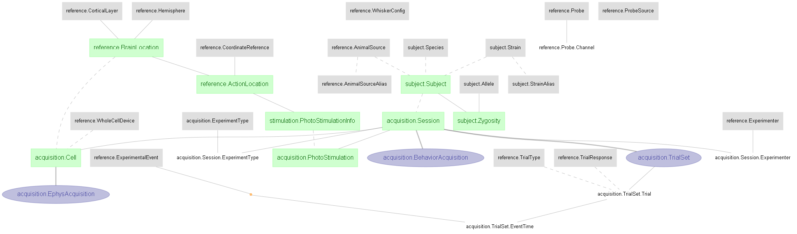

# Hire-Gutnisky-2015 - A DataJoint example
This notebook presents data and results associated with the following papers:
>Samuel Andrew Hires, Diego A Gutnisky, Jianing Yu, Daniel H O’Connor, and Karel Svoboda. "Low-noise encoding of active touch by
layer 4 in the somatosensory cortex" (2015) eLife (http://doi.org/10.7554/eLife.06619)

This study investigated the spiking variability of layer 4 (L4) excitatory neurons in the mouse barrel cortex, using intracellular and extracellular recordings. The recordings were performed during a object locating task, where whisker movements and contacts with object were tracked to the milisecond precision. Spiking patterns in L4 neurons appeared irregular at first, however upon alingning to the fine-scale structure of the behavior, the study revealed that spiking patterns are coupled to the temporal sensory input from object contact, with spike rate increases shortly after touch.

A ***DataJoint*** data pipeline has been constructed for this study, with the presented data ingested into this pipeline. This notebook demonstrates the queries, processing, and reproduction of several figures from the paper. From the pipeline, export capability to NWB 2.0 format is also available.

## About the data

The dataset comprises of membrane potential, extracellular recordings and spike sorted results of layer 4 (L4) neurons of the mouse's barrel cortex (around C2 column) during a whisker-based object locating task. The behavior data includes detailed description of the trial structure (e.g. trial timing, trial instruction, trial response, etc.) and a variety of whisker movement related tracking data: whisker position, whisker phase, whisker curvature change, touch times, etc.

Original data shared here: http://crcns.org/data-sets/ssc/ssc-5/about-ssc-5

The data in original MATLAB format (.mat) have been ingested into a DataJoint data pipeline presented below. This notebook demonstrates the queries, processing, and reproduction of several figures from the paper. 

Data are also exported into NWB 2.0 format. 

## Design DataJoint data pipeline 
This repository will contain the Python 3.6+ code of the DataJoint data pipeline design for this dataset, as well as scripts for data ingestions and visualization

## Conversion to NWB 2.0
This repository will contain the Python 3.6+ code to convert the DataJoint pipeline into NWB 2.0 format (See https://neurodatawithoutborders.github.io/)

See NWB export code [here](../scripts/datajoint_to_nwb.py)

## Architecture of the data pipeline

